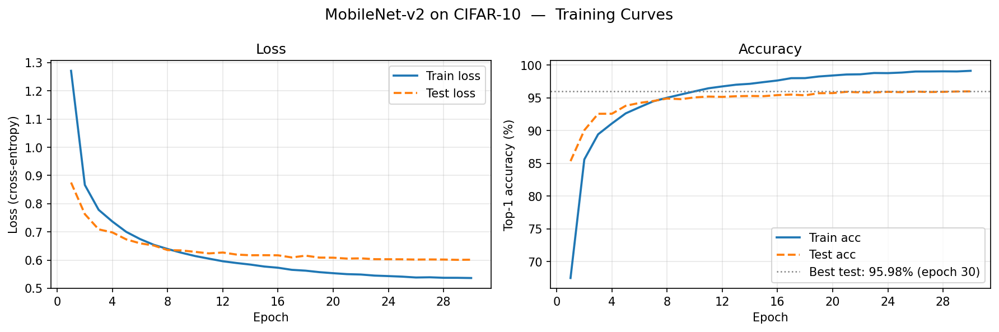
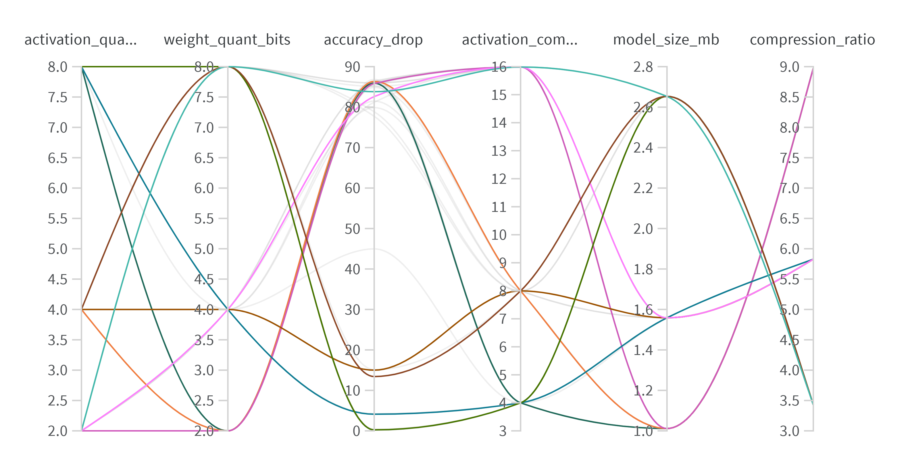

# CS6886 — Assignment 2: MobileNet-v2 Compression on CIFAR-10

## Repository structure

```
├── data.py              # CIFAR-10 loading + augmentation
├── model.py             # MobileNet-v2 adapted for 32×32 inputs
├── train.py             # Fine-tuning script (Q1)
├── quantize.py          # Custom weight quantisation from scratch (Q2)
├── activation_quant.py  # Calibration-based activation quantisation (Q2)
├── utils.py             # Storage / compression-ratio accounting (Q2c, Q4)
├── test.py              # Single experiment runner (Q3, Q4)
├── sweep.py             # Wandb grid sweep for parallel coordinates chart (Q3b)
├── plot_curves.py       # Generate loss/accuracy curves from saved history (Q1c)
└── requirements.txt
```

---

## Environment

```bash
# Python 3.10+ recommended
pip install -r requirements.txt

# Log in to Wandb (needed only for sweep.py)
wandb login
```

---

## Reproducing results

### Step 1 — Train the baseline model (Q1)

```bash
# Fine-tune from ImageNet pretrained weights (recommended)
python train.py --epochs 30 --batch_size 128 --lr 0.01 --seed 42

# Optional: also log training curves to Wandb
python train.py --epochs 30 --batch_size 128 --lr 0.01 --seed 42 --use_wandb

# Train from scratch (no pretrained weights)
python train.py --epochs 100 --no_pretrained --lr 0.05 --seed 42
```

Outputs written to the working directory:
- `best_model.pth` — checkpoint with best validation accuracy
- `training_history.json` — per-epoch train/test loss and accuracy

### Step 2 — Plot training curves (Q1c)

```bash
python plot_curves.py --history training_history.json --out training_curves.png
```

<!-- INSERT FIGURE 1 BELOW — replace this comment with the image after running plot_curves.py -->
<!--  -->


---

### Step 3 — Single quantisation experiment (Q3, Q4)

```bash
# 8-bit weights + 8-bit activations  →  95.57% accuracy, 3.424× weight compression
python test.py --weight_quant_bits 8 --activation_quant_bits 8

# 4-bit weights + 4-bit activations  →  73.34% accuracy, 5.828× weight compression
python test.py --weight_quant_bits 4 --activation_quant_bits 4

# 2-bit weights + 2-bit activations  →  10.42% accuracy, 8.981× weight compression
python test.py --weight_quant_bits 2 --activation_quant_bits 2
```

### Step 4 — Full Wandb sweep for parallel coordinates chart (Q3b)

```bash
python sweep.py --wandb_project cs6886-mobilenetv2-compression
```

Runs a 3×3 grid: `weight_bits ∈ {2,4,8}` × `activation_bits ∈ {2,4,8}` (9 runs total).  


---

## Model configuration (Q1b)

| Setting | Value | Reason |
|---|---|---|
| width_mult | 1.0 | Matches ImageNet pretrained checkpoint exactly |
| Dropout | 0.2 | Torchvision default; regularises the classifier head |
| BatchNorm | eps=1e-5, momentum=0.1 | Pretrained running stats computed at these defaults |
| Stem stride | 2 → 1 (modified) | Prevents 32×32 → 1×1 feature-map collapse |
| features[2] depthwise stride | 2 → 1 (modified) | Reduces total downsampling from 32× to 8× |
| Optimiser | SGD + Nesterov, momentum=0.9 | Better generalisation than Adam on CNN benchmarks |
| Weight decay | 4e-5 | Small; avoids underfitting the parameter-efficient depthwise layers |
| Initial LR | 0.01 | Fine-tuning rate; lower than scratch to protect pretrained weights |
| LR schedule | Linear warmup (5 ep) + CosineAnnealingLR | Smooth decay; no manual milestone tuning |
| Label smoothing | 0.1 | Regularises loss without shrinking parameter count |
| Gradient clipping | max_norm=1.0 | Prevents instability during the warmup phase |
| Epochs | 30 | Sufficient for fine-tuning; ~4× fewer than training from scratch |
| Batch size | 128 | Standard for CIFAR-10; fits a single 4 GB GPU |
| Random seed | 42 | Fixed via `torch.manual_seed()` for reproducibility |

---

## Compression method (Q2)

### Weights — symmetric per-channel fake quantisation

For each `Conv2d` / `Linear` layer (excluding stem and classifier head):

```
scale_c  = max(|W_c|) / (2^(bits-1) − 1)    # one scale per output channel c
q_c      = clamp(round(W_c / scale_c), qmin, qmax)
Ŵ_c      = scale_c × q_c                     # zero_point = 0 (symmetric)
```

**Why symmetric?** Weights are roughly zero-centred; fixing `zero_point = 0` wastes ≤1 representable level while halving metadata and simplifying inference arithmetic.

**Why per-channel?** Weights in different output channels have different magnitude ranges. Per-channel scale costs only `n_channels × 8 bytes` of extra metadata while substantially reducing quantisation error vs a single global scale.

### Activations — asymmetric per-tensor PTQ calibration

Measured at the output of every `ReLU6` (35 layers), which feeds directly into the next Conv2d:

```
Calibration : run 50 training batches, collect activation samples per layer
Range       : t_min, t_max = 99.9th-percentile clip (capped to [0, 6] for ReLU6)
scale       = (t_max − t_min) / (2^bits − 1)
zero_point  = round(qmin − t_min / scale)
fake_quant  → applied via forward hook at inference time
```

**Why asymmetric?** `ReLU6` output is always in `[0, 6]`. Symmetric quantisation would waste half the integer range on negative values that never occur.

**Why percentile clipping?** Rare outlier activations can stretch the scale and waste most representable levels. Clipping to the 99.9th percentile prevents this, recovering several percent of accuracy at 4-bit.

### BN recalibration

After weight quantisation, 50 training batches are run through the model in `model.train()` mode to update BatchNorm running statistics. Without this step, the stale BN stats (computed on fp32 weights) cause a distribution mismatch that can cost 10–20% accuracy at 4-bit.

### Layers skipped

| Layer | Reason |
|---|---|
| `features.0.0` (stem Conv2d) | Tiny parameter count; first feature-extraction layer; high accuracy sensitivity |
| `classifier.1` (final Linear) | Closest to the loss; most sensitive to numerical error |
| All `BatchNorm2d` | < 1% of model size; direct effect on activation scale makes quantisation disproportionately harmful |
| All bias tensors | Negligible size; quantising at low bits destabilises output distributions |

### Storage overheads (Q2c)

| Component | Formula | Value (8-bit, per-channel) |
|---|---|---|
| Quantised weight payload | `n_weights × bits` | varies per layer |
| Weight scale metadata | `n_channels × 32 bits` | 0.068 MB total |
| Weight zero_point metadata | `n_channels × 32 bits` | 0.068 MB total |
| **Total weight metadata** | | **0.136 MB** |
| Biases (fp32) | `n_bias × 32 bits` | included in model size |
| BatchNorm params + running stats | `(params + buffers) × 32 bits + 64 bits` | included in model size |
| Activation metadata (per ReLU6 layer) | `2 × 32 bits` | 0.28 KB total (35 layers) |

---

## Results (Q3, Q4)

Baseline fp32 test accuracy: **95.98%** — Original model size: **9.084 MB**

| Config | Weight CR | Activation CR | Model size | Quantised acc. | Accuracy drop |
|---|---|---|---|---|---|
| fp32 baseline | 1.000× | 1.000× | 9.084 MB | 95.98% | — |
| **w8, a8** | **3.424×** | **3.999×** | **2.653 MB** | **95.57%** | **0.41%** |
| w4, a4 | 5.828× | 7.997× | 1.559 MB | 73.34% | 22.64% |
| w2, a2 | 8.981× | 15.988× | 1.011 MB | 10.42% | 85.56% |

**Chosen configuration for Q4: w8, a8** — 3.424× weight compression, 3.999× activation compression, 95.57% accuracy, 2.653 MB final model size. Activation compression ratio is measured as the sum of all 35 ReLU6 output tensors per image (original 6,008.83 KB fp32 → 1,502.49 KB at 8-bit + 0.28 KB metadata).

The 4-bit accuracy drop (22.64%) reflects MobileNet-v2's known PTQ sensitivity in depthwise-separable layers. The 2-bit result (10.42%) equals random-chance for 10-class CIFAR-10, confirming complete model collapse. This is expected for PTQ without Quantisation-Aware Training (QAT).

---

## Seed configuration (Q5b)

All scripts accept `--seed` (default `42`). The seed is applied at the start of `train.py`:

```python
torch.manual_seed(args.seed)
torch.cuda.manual_seed_all(args.seed)
```

For strict DataLoader reproducibility across machines, use `--num_workers 0` or `--num_workers 2`.
